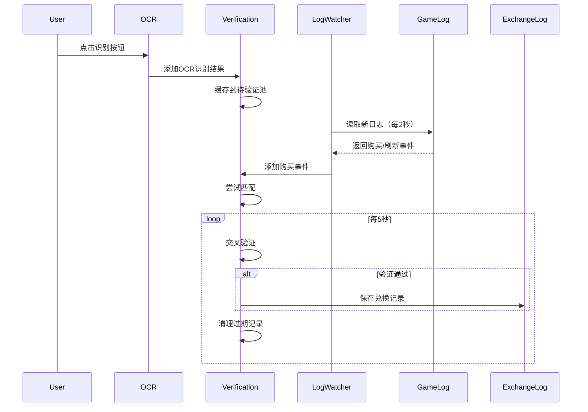

# 兑换验证功能说明

## 功能概述

系统现已实现了完整的兑换验证功能，通过交叉对比OCR识别结果和游戏日志来确认用户实际购买的物品。

## 核心功能

### 1. 游戏日志监控

- **服务**: `GameLogWatcherService`
- **功能**: 持续监控游戏日志文件（基于游戏进程路径动态拼接）
- **日志路径**: `{游戏进程目录}/UE_game.log`
- **监控内容**:
  - 购买事件 (`BuyVendorGoods`)
  - 刷新商店事件
- **检查间隔**: 每2秒检查一次
- **自动初始化**: 在窗口绑定游戏后自动初始化并启动监控

### 2. 日志解析

- **服务**: `GameLogParserService`
- **功能**: 解析游戏日志，提取关键信息
- **识别的事件**:
  - **购买事件**: 物品ID、物品名称、数量、消耗的神威辉石数量
  - **刷新事件**: 消耗的神威辉石数量（通常为50）

### 3. 兑换验证

- **服务**: `ExchangeVerificationService`
- **功能**: 将OCR识别结果与游戏日志事件交叉验证
- **验证逻辑**:
  1. **时间窗口**: OCR识别和日志记录的时间差在30秒内
  2. **神威辉石消耗**: OCR识别的价格与日志中的消耗数量一致
  3. **物品名称匹配**: 通过物品价格服务进行智能模糊匹配
- **缓存机制**:
  - OCR结果缓存60秒后过期
  - 未验证的记录持久化到 `ocr_recognition_log.json`

### 4. 兑换日志管理

- **服务**: `ExchangeLogService`
- **功能**: 管理验证通过的购买记录
- **存储文件**: `exchange_log.json`
- **数据结构**:
  ```json
  {
    "timestamp": "2025-02-13T14:30:45",
    "item_name": "初火源质",
    "item_id": 100300,
    "item_quantity": "1",
    "original_price": 1.0,
    "converted_price": 0.79,
    "profit": 0.21,
    "gem_cost": 50,
    "ocr_timestamp": "2025-02-13T14:30:40",
    "log_timestamp": "2025-02-13T14:30:45",
    "verified": true
  }
  ```

### 5. 刷新日志管理

- **服务**: `RefreshLogService`
- **功能**: 记录商店刷新事件
- **存储文件**: `refresh_log.json`
- **数据结构**:
  ```json
  {
    "timestamp": "2025-02-13T14:30:45",
    "gem_cost": 50,
    "log_context": {}
  }
  ```

### 6. 定期监控

- **服务**: `ExchangeMonitorService`
- **功能**: 定期执行验证和保存操作
- **检查间隔**: 每5秒
- **任务**:
  - 验证待处理的OCR记录
  - 保存验证通过的兑换记录
  - 保存刷新事件
  - 清理过期的OCR缓存记录

## 工作流程



## 文件结构

```
TorchOverlay/
├── domain/models/
│   ├── buy_event.py              # 购买事件模型
│   ├── refresh_event.py          # 刷新事件模型
│   └── exchange_record.py        # 兑换记录模型
├── services/
│   ├── game_log_parser_service.py         # 游戏日志解析
│   ├── game_log_watcher_service.py        # 游戏日志监控
│   ├── exchange_verification_service.py   # 兑换验证
│   ├── exchange_log_service.py           # 兑换日志管理
│   ├── refresh_log_service.py            # 刷新日志管理
│   └── exchange_monitor_service.py        # 兑换监控
├── exchange_log.json            # 验证通过的购买记录
├── ocr_recognition_log.json     # 所有OCR识别记录
└── refresh_log.json             # 刷新商店记录
```

## 配置说明

### 游戏日志路径

游戏日志路径会根据绑定的游戏进程自动动态拼接：
1. 系统会获取游戏进程的可执行文件路径
2. 提取进程所在目录
3. 在该目录下查找 `UE_game.log` 文件

**示例**:
- 游戏进程路径: `D:\TapTap\PC Games\172664\UE5-Win64-Shipping.exe`
- 游戏进程目录: `D:\TapTap\PC Games\172664\`
- 游戏日志路径: `D:\TapTap\PC Games\172664\UE_game\Torchlight\Saved\Logs\UE_game.log`

如果无法获取进程路径，系统会使用默认路径并记录警告。

### 验证参数

可在 `ExchangeVerificationService` 中调整：
- `DEFAULT_VERIFICATION_WINDOW = 30`: 验证时间窗口（秒）
- `DEFAULT_CACHE_EXPIRE_TIME = 60`: OCR缓存过期时间（秒）

## 兼容性说明

### 旧版 exchange_log.json

系统保持了对旧版日志格式的兼容：
- 旧格式: `{item_name, quantity, original_price, converted_price, profit, status}`
- 新格式: 增加了 `timestamp, item_id, gem_cost, ocr_timestamp, log_timestamp, verified` 字段

旧数据仍可正常读取，新数据将使用新格式。

### 向后兼容

当未提供验证服务时，系统会回退到旧的行为（直接写入 `exchange_log.json`）。

## 使用建议

1. **首次使用**: 系统会自动启动游戏日志监控和兑换验证
2. **日志查看**:
   - `exchange_log.json`: 查看确认购买的物品
   - `refresh_log.json`: 查看刷新记录
   - `ocr_recognition_log.json`: 查看所有OCR识别记录（包括未验证的）
3. **调试**: 启用OCR调试模式可查看详细的验证日志

## 故障排查

### 游戏日志未读取

1. 确认游戏已正确绑定
2. 确认游戏进程路径可访问（需要管理员权限）
3. 确认游戏日志文件 `UE_game.log` 存在于游戏目录
4. 查看日志输出，确认实际的游戏日志路径
5. 检查文件权限，确保应用有读取权限

### 验证未通过

1. 查看日志时间戳是否在30秒窗口内
2. 确认OCR识别的神威辉石数量与实际消耗一致
3. 检查物品名称是否正确匹配

### 性能优化

- 调整 `check_interval` 参数来平衡实时性和性能
- 定期清理 `ocr_recognition_log.json` 中的旧记录
