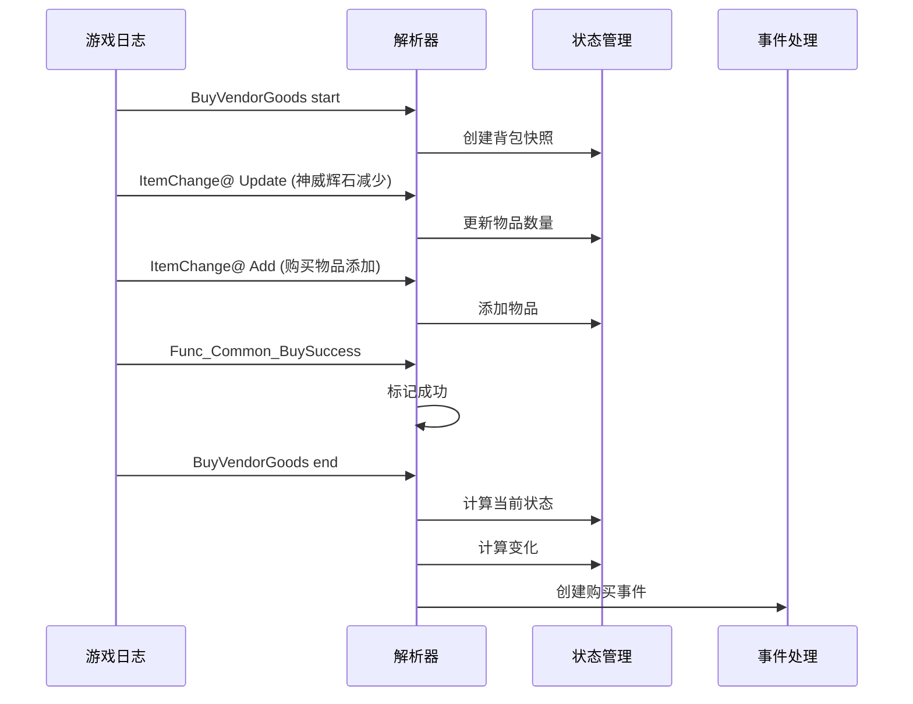

# 日志解析服务重构说明

## 修改概述

基于 `GameLogMonitor` 项目的正确日志解析逻辑，完全重构了游戏日志解析服务，修复了之前使用错误正则表达式导致的问题。

## 问题分析

### 之前的错误

1. **错误的日志格式解析**：
   - 使用 `BagMgr@:Modfy` 来检测物品变化（错误）
   - 使用 `ConfigBaseId` 和 `Num` 字段（错误）

2. **错误的事件处理**：
   - 等待 `Push2` 事件来完成购买（不必要）
   - 事件边界检测不准确

### 正确的日志格式

```
ItemChange@ Update Id=5210_12345 BagNum=30633 in PageId=102 SlotId=5
ItemChange@ Add Id=100200_67890 BagNum=1 in PageId=102 SlotId=10
ItemChange@ Delete Id=100200_67890 in PageId=102 SlotId=10
```

### 正确的正则表达式

```python
# 物品更新
ITEM_UPDATE_PATTERN = re.compile(
    r"ItemChange@\s+Update\s+Id=([^\s]+)\s+BagNum=(\d+)\s+in\s+PageId=(-?\d+)\s+SlotId=(\d+)"
)

# 物品添加
ITEM_ADD_PATTERN = re.compile(
    r"ItemChange@\s+Add\s+Id=([^\s]+)\s+BagNum=(\d+)\s+in\s+PageId=(\d+)\s+SlotId=(\d+)"
)

# 物品删除
ITEM_DELETE_PATTERN = re.compile(
    r"ItemChange@\s+Delete\s+Id=([^\s]+)\s+in\s+PageId=(\d+)\s+SlotId=(\d+)"
)
```

## 文件修改

### 新增文件

1. **`domain/models/item_update.py`**
   - `UpdateItemInfo`: 物品更新信息
   - `AddItemInfo`: 物品添加信息
   - `DeleteItemInfo`: 物品删除信息
   - `ItemChange`: 物品变更的统一表示

2. **`services/inventory_state_manager.py`**
   - `InventoryStateManager`: 背包状态管理器
   - 追踪背包中所有物品的数量
   - 提供背包快照功能
   - 判断背包是否已初始化

3. **`test_log_parser.py`**
   - 测试新的日志解析逻辑

### 修改文件

1. **`services/game_log_parser_service.py`**
   - 完全重写日志解析逻辑
   - 使用正确的正则表达式
   - 不再等待 `Push2` 事件
   - 通过 `Update` 事件中 `BagNum` 的变化来计算神威辉石消耗
   - 添加背包初始化逻辑

## 核心改进

### 1. 正确的物品ID解析

物品ID格式: `BaseId_InstanceId`
例如: `5210_12345` -> 提取基础ID: `5210`

### 2. 事件边界检测

| 事件类型 | 开始标记 | 结束标记 |
|---|---|---|
| 购买物品 | `ItemChange@ ProtoName=BuyVendorGoods start` | `ItemChange@ ProtoName=BuyVendorGoods end` |
| 刷新商店 | `ItemChange@ ProtoName=RefreshVendorShop start` | `ItemChange@ ProtoName=RefreshVendorShop end` |
| 背包初始化 | `LoadUILogicProgress=2` | `LoadUILogicProgress=3` |

### 3. 不再等待 Push2 事件

之前的问题：
- 在等待 `Push2` 事件时，如果文件结束会被强制关闭
- 导致购买事件失败

新的逻辑：
- 直接在 `BuyVendorGoods end` 时处理事件
- 通过比较快照和当前状态来识别物品变化

### 4. 背包状态管理

```python
class InventoryStateManager:
    - is_backpack_initialized: 背包是否已初始化
    - create_snapshot(): 创建背包快照
    - apply_item_change(): 应用物品变更
    - calculate_changes(): 计算物品变化
```

## 事件处理流程

### 购买事件流程



### 神威辉石消耗计算

通过比较事件开始前后的神威辉石数量：

```python
old_num = snapshot.get('5210', 0)
new_num = current_state.get('5210', 0)
gem_cost = old_num - new_num  # 神威辉石消耗量
```

### 购买物品识别

1. 优先识别 `gained_items` 中数量增加的物品（排除神威辉石）
2. 如果没有增加的物品，可能需要检查日志格式或物品ID

## 常量定义

```python
# 物品ID
GEM_BASE_ID = "5210"  # 神威辉石基础ID

# 页面ID
PAGE_ID_EQUIPMENT = 100  # 装备页
PAGE_ID_SKILL = 101  # 技能页
PAGE_ID_CONSUMABLE = 102  # 消耗品页
PAGE_ID_WAREHOUSE = -1  # 仓库页

# 支持的事件类型
SUPPORTED_EVENTS = {
    'BuyVendorGoods',  # 购买商店物品
    'RefreshVendorShop',  # 刷新商店
    'Push2',  # 物品推送/副本结算
    'ResetItemsLayout',  # 背包重排
    'PickItems',  # 拾取物品
    'ExchangeItem',  # 交换物品
    'OpenRewardBox',  # 打开奖励箱
    'ReCostItem',  # 重新消耗物品
}
```

## 测试

运行测试脚本验证新的日志解析逻辑：

```bash
python test_log_parser.py
```

## 下一步

1. 测试新的解析服务是否正确识别购买和刷新事件
2. 检查实际的游戏日志文件，验证正则表达式是否匹配
3. 如果有问题，根据实际日志格式调整正则表达式
4. 添加更多单元测试

## 参考资料

- GameLogMonitor 项目: `D:\GameLogMonitor`
- 关键解析器:
  - `Parsers/BuyVendorGoodsParser.cs`
  - `Parsers/Push2Parser.cs`
  - `Parsers/RefreshVendorShopParser.cs`
  - `Parsers/LoginInitParser.cs`
- 背包状态管理:
  - `Managers/Inventory/InventoryStateManager.cs`

---

## 服务器识别功能（新增）

### 功能概述

除了日志解析功能外，还添加了服务器识别功能，用于区分不同服务器（永久区/赛季区/专家区）的兑换日志。

### 服务器类型

| 服务器类型 | Season ID | 说明 |
|---|---|---|
| 永久区 | 1 | 永久服务器 |
| 赛季区 | 1201 | 赛季服务器 |
| 专家区 | 1231 | 专家服务器 |

### 新增文件

1. **`domain/models/season.py`**
   - `SeasonServerType` 枚举
   - `resolve_season_type()` 函数

2. **`domain/models/player_info.py`**
   - `PlayerInfo` 数据类

3. **`services/season_resource_service.py`**
   - `SeasonResourceService` 类
   - 管理不同服务器的配置和数据

4. **`test_season_parser.py`**
   - 测试服务器识别功能

5. **`docs/SEASON_RECOGNITION.md`**
   - 服务器识别功能详细文档

### 日志格式

```
[Game] +player+
[Game] +player+Name[玩家名]
[Game] +player+SeasonId[赛季ID]
```

### 使用示例

```python
from services.game_log_parser_service import GameLogParserService

parser = GameLogParserService()

# 解析日志
buy_events, refresh_events = parser.parse_new_events()

# 获取玩家信息
player_info = parser.get_player_info()
if player_info:
    print(f"玩家: {player_info.name}")
    print(f"服务器: {player_info.season_type}")

# 获取服务器标签
season_label = parser.get_season_label()
print(f"服务器: {season_label}")
```

### 详细文档

服务器识别功能的详细文档请参考: `docs/SEASON_RECOGNITION.md`
